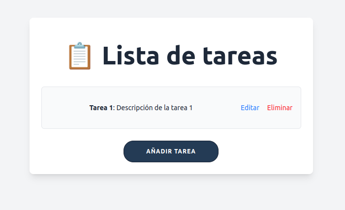
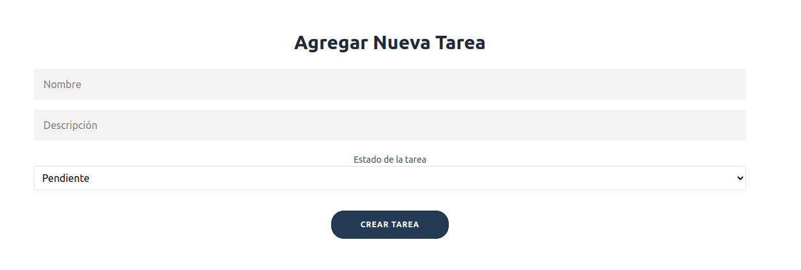
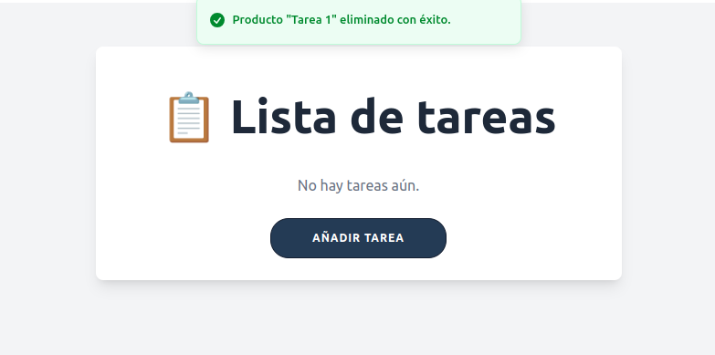

# ForIT_challenge

Cloná el repositorio:
- git clone https://github.com/sofisando/ForIT_challenge.git
- cd ForIT_challeng

*Es necesario contar con Node.js instalado*

-----------------------------
Para instalar dependencias necesarias:

- cd backend
- npm install
- cd..
- cd frontend
- npm install

------------------------------
Ejecutar la aplicación:

-- Backend:
(en una terminal en la ruta raiz de la app)
- cd backend
- npm run dev
(esto correrá el servidor Express)

-- Frontend:
(en otra terminal en la ruta raiz de la app)
- cd frontend
- npm run dev
(Esto levantará la app de React en http://localhost:5173)
